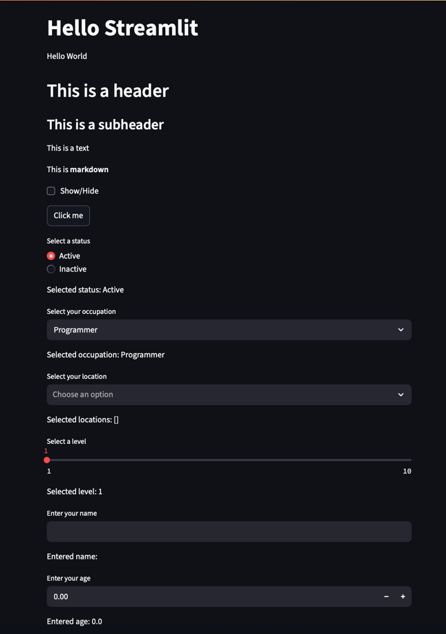
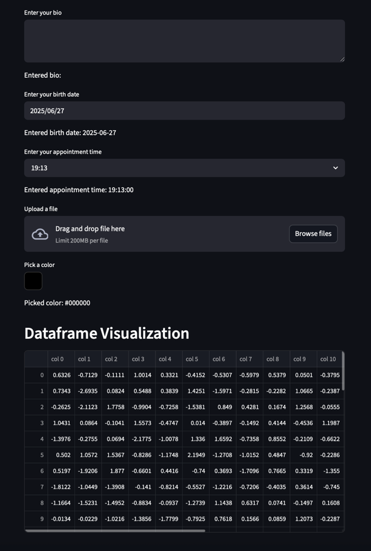
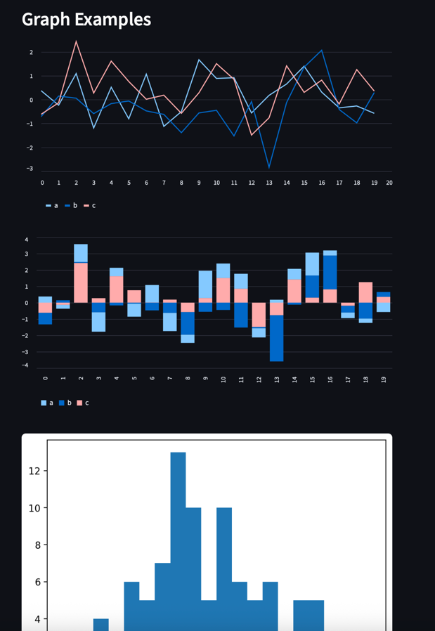
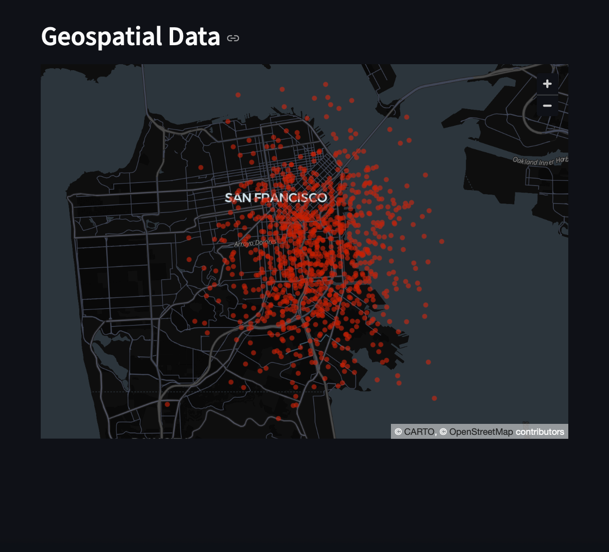

# Streamlit POC

This is a proof of concept for a Streamlit application.

## What is Streamlit?

Streamlit is an open-source Python library that makes it easy to create and share beautiful, custom web apps for machine learning and data science. In just a few minutes you can build and deploy powerful data apps.

## How to run the application

1.  Install the dependencies:

    ```bash
    pip install -r requirements.txt
    ```

2.  Run the application:

    ```bash
    streamlit run app.py
    ```

## Components

This application demonstrates the following Streamlit components:

*   `st.title`
*   `st.header`
*   `st.subheader`
*   `st.text`
*   `st.markdown`
*   `st.checkbox`
*   `st.button`
*   `st.radio`
*   `st.selectbox`
*   `st.multiselect`
*   `st.slider`
*   `st.text_input`
*   `st.number_input`
*   `st.text_area`
*   `st.date_input`
*   `st.time_input`
*   `st.file_uploader`
*   `st.color_picker`
*   `st.dataframe`
*   `st.line_chart`
*   `st.bar_chart`
*   `st.pyplot`
*   `st.map`

## Images




